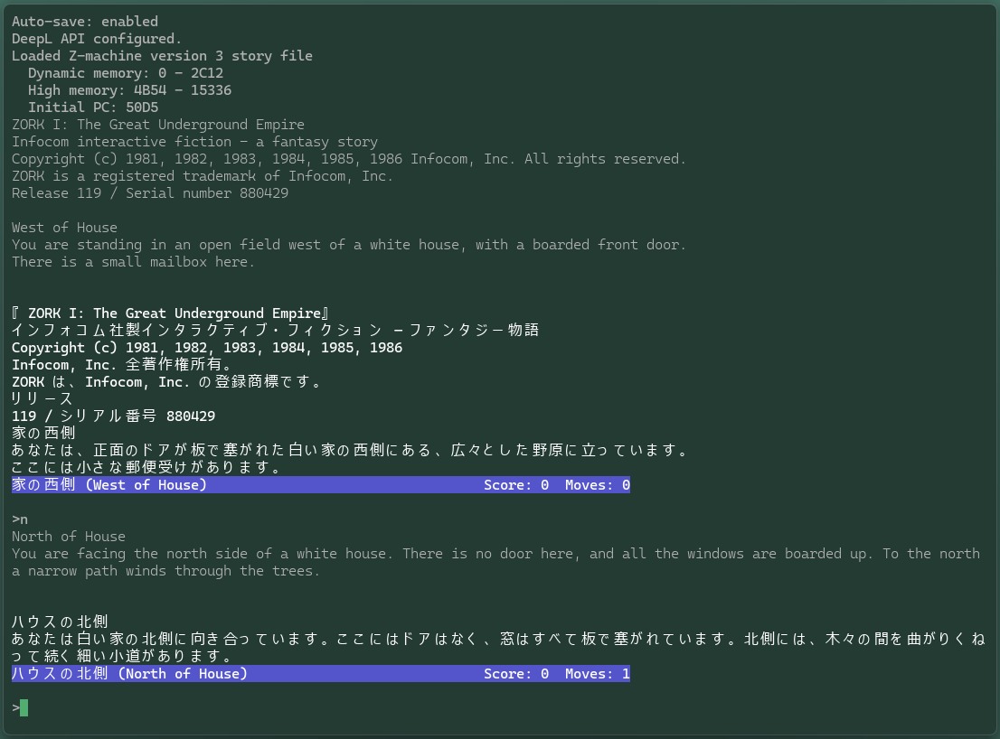
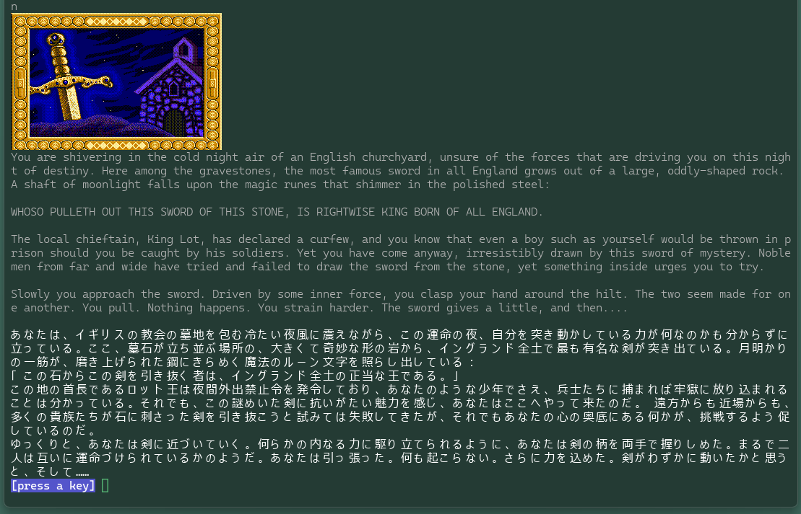

# Z-machine Interpreter

A Z-machine interpreter written in Common Lisp. Play classic text adventures like Zork in 10 languages.

## Supported Languages

| Code | Language | Native |
| --- | --- | --- |
| :en | English | English |
| :ja | Japanese | 日本語 |
| :ko | Korean | 한국어 |
| :zh-hans | Simplified Chinese | 简体中文 |
| :zh-hant | Traditional Chinese | 繁體中文 |
| :fr | French | Français |
| :de | German | Deutsch |
| :es | Spanish | Español |
| :pt | Portuguese | Português |
| :ru | Russian | Русский |

## Features

* Z-machine version 1-8 support, verified against 34 story files and the CZECH conformance suite
* Bilingual display (English + translation)
* Status line with location, score and turn count (V1-3)
* Original, translation and status line styled apart in the terminal
* Auto-translation via Ollama (local LLM, any model), DeepL or Claude API
* Glossary for consistent terminology
* Translation caching and persistence
* Save/Restore game state

## Screenshots

Zork I in Japanese. The original English is dimmed, the translation follows it,
and the status line carries the room name in both languages.



Arthur, a Version 6 story. Its illustration is drawn in the terminal with sixel
graphics, above the same bilingual text.



## Requirements

* SBCL (Steel Bank Common Lisp)
* curl (for auto-translation)
* Ollama (optional, for local LLM translation - no API key needed)

## Obtaining Story Files (.z3, .z5)

To play games on the Z-machine, you need story files. Here's how to obtain them:

### ZORK I, II, III (Open Source)

In November 2025, Microsoft open-sourced ZORK I, II, and III under the MIT License. Story files (.z3 extension) can be obtained from the COMPILED directory at the following repositories:

* [Zork 1 - historicalsource](https://github.com/historicalsource/zork1)
* [Zork 2 - historicalsource](https://github.com/historicalsource/zork2)
* [Zork 3 - historicalsource](https://github.com/historicalsource/zork3)

### Interactive Fiction Archive

The [IF Archive](https://ifarchive.org/) hosts many Z-machine compatible games.

### File Naming Conventions

* `.z3` - Z-machine version 3 (Infocom classics including ZORK)
* `.z4` - Z-machine version 4 (larger Infocom games)
* `.z5` - Z-machine version 5 (later Infocom games)
* `.z6` - Z-machine version 6 (graphical games; text only here)
* `.z8` - Z-machine version 8 (extended format)

Tested against the story files and conformance test suites collected in
[jeffnyman/zifmia](https://github.com/jeffnyman/zifmia/tree/master), which
gathers Z-machine stories of every version together with the CZECH and
TerpEtude test suites and their reference output.

Tested against 34 story files:

The CZECH conformance suite passes completely: 406 passed, 0 failed, matching
its reference output.

| Version | Stories | Status |
|:--|--:|:--|
| 1 (`.z1`) | 1 | Plays |
| 2 (`.z2`) | 1 | Plays |
| 3 (`.z3`) | 17 | All play |
| 4 (`.z4`) | 3 | All play; timed input is ignored |
| 5 (`.z5`) | 8 | All play |
| 6 (`.z6`) | 2 | Play as text, Zork Zero included; no graphics, and the upper window is drawn as a status bar rather than laid out in pixels |
| 8 (`.z8`) | 1 | Plays |

Place story files in the same directory as the interpreter, or specify the full path when loading.

## Installation

```bash
git clone https://github.com/fukuyori/zmachine-multilingual.git
cd zmachine-multilingual
```

## Usage

### Quick Start

Edit the following sections in run-zork.lisp and run with SBCL.

- Set up story file

```lisp
;; Specify the path to the story file you want to play
(load-story "zork1.z3")           ; If in the same directory
(load-story "/path/to/zork1.z3")  ; Specify with full path
```

- Change language

```lisp
;; Can be changed during gameplay
(set-language :fr)    ; Switch to French
(set-language :en)    ; English only (no translation)
```

- Set up auto-translation

```lisp
;; Ollama (local LLM, no API key)
(list-ollama-models)          ; show installed models
(setup-ollama "qwen3.5:9b")   ; pick the model to translate with

;; DeepL API (free tier available)
(setup-deepl "your-api-key")

;; Or Claude API
(setup-claude-api "your-api-key")
```

Get a free DeepL API key at https://www.deepl.com/pro-api

`*deepl-url*` selects the endpoint. Keep the default for a free key; set it to
`https://api.deepl.com/v2/translate` for a Pro key. `(test-deepl-api)` shows the
raw response and, when a request is rejected, the reason DeepL gives.

- Run from command line

```bash
sbcl --script run-zork.lisp
```

### Cache File Names

There is exactly one translation cache. It lives in `translations/`, is read at
startup, and is written back as you play. By default it is
`translations/translations-<language>.lisp` - the file that ships with the
repository. Name a different one in `run-zork.lisp` to keep a separate cache per
game or per playthrough; a bare file name goes inside `translations/` too.

```lisp
;; run-zork.lisp - must come before (set-language ...)
(set-translation-file "zork2-ja.lisp")   ; -> translations/zork2-ja.lisp
(set-glossary-file "zork2-ja-glossary.lisp")

(set-language :ja)
```

```lisp
(show-config)                        ; what the settings resolve to
(set-translation-file nil)           ; back to the language-derived name
```

| Variable | Default | Description |
|:--|:--|:--|
| `*translation-file*` | `NIL` | Cache file name, `NIL` = `translations-<language>.lisp` |
| `*translations-dir*` | `"translations/"` | Directory the cache lives in |
| `*glossary-file*` | `NIL` | Glossary file name, `NIL` = `glossary-<language>.lisp` |
| `*glossaries-dir*` | `"glossaries/"` | Directory the glossary lives in |

The glossary works exactly the same way: one file in `glossaries/`, read at
startup and rewritten by `(save-glossary)`.

A name that already contains a directory, such as `"saves/mine-ja.lisp"`, is
used as given instead of being placed under `translations/` or `glossaries/`.

A file that does not exist yet is reported at startup and created on the first
save. Directories in the name are created as needed.

### Local Translation with Ollama

If an Ollama server is running, any installed model can be used - no API key required.

```lisp
(list-ollama-models)                 ; list available models
(setup-ollama "gemma3:12b")          ; enable Ollama with this model
(setup-ollama "qwen3.5:9b" "http://192.168.1.10:11434")  ; remote server
(set-ollama-model "translategemma:12b")  ; switch model only
(test-ollama)                        ; check connection and translation
```

Tuning variables:

| Variable | Default | Description |
|:--|:--|:--|
| `*ollama-url*` | `"http://localhost:11434"` | Ollama server URL |
| `*ollama-model*` | `"gemma3:4b"` | Model used for translation |
| `*ollama-temperature*` | `0.2` | Lower = more consistent wording |
| `*ollama-num-predict*` | `1024` | Maximum tokens to generate |
| `*ollama-think*` | `nil` | Allow thinking output on reasoning models (slower) |

Small models (around 4B) tend to garble word order. 9B-12B or larger is recommended.

### Glossary (Terminology Consistency)

Terms registered in `glossaries/glossary-<code>.lisp` are injected into the prompt
whenever they appear in the source text, so the LLM always picks the same wording
(Ollama and Claude backends). The glossary is loaded automatically with the language.

```lisp
;; glossaries/glossary-ja.lisp
(add-glossary "brass lantern" "真鍮のランタン")
(add-glossary "grue" "グルー")
(add-glossary "trap door" "仕掛け扉")
```

```lisp
(show-glossary)                    ; list registered terms
(add-glossary "thief" "泥棒")      ; add at runtime
(remove-glossary "thief")          ; remove
(save-glossary)                    ; write glossary-ja.lisp to the current directory

(glossary-check)                   ; find cached translations that break the glossary
(glossary-fix)                     ; re-translate them through the API
```

When a translation drops a glossary term, it is retried once with that term
emphasized (while `*glossary-enforce*` is `t`; set it to `nil` to disable).

Avoid very common words such as `score` or `moves` - they are usually rendered with
counters or particles and only produce false warnings. Register proper nouns and
object names instead.

### Telling the Three Kinds of Output Apart

The original English, the translation and the status line are styled differently
so they can be told apart at a glance:

| | Style |
|:--|:--|
| Original English | Dimmed, so the translation reads as the main text |
| Translation | Bright white |
| Status line | Bright white on blue, like a status bar |

```lisp
(setf *ansi-enabled* nil)      ; plain text, no escape sequences
(setf *ansi-source* "90")      ; grey original instead of dim
(setf *ansi-translation* "0")  ; leave the translation at the terminal default
(setf *ansi-status* "7")       ; reverse video status line
```

| Variable | Default | Description |
|:--|:--|:--|
| `*ansi-enabled*` | `T` | `T` always writes colour, `NIL` never does, `:auto` turns it off when output is not a terminal |
| `*ansi-source*` | `"2"` | SGR parameters for the original English |
| `*ansi-translation*` | `"97"` | SGR parameters for the translation |
| `*ansi-status*` | `"44;97"` | SGR parameters for the status line |

Escape sequences are written only to the terminal, never into the Z-machine
output buffer. Set `*ansi-enabled*` to `:auto` to keep them out of redirected
output as well, or to `NIL` to turn colour off entirely.

Avoid bold (`"1"`) for the translation: terminals render bold with a bold font
face, and most Japanese fonts have none, so only the Latin letters would come
out bold. Brightness and colour apply evenly to every script.

### Status Line

In Versions 1-3 the interpreter is responsible for drawing the status line. It is
printed on one line just before each `>` prompt, with the location on the left and
the score on the right.

```
West of House                                             Score: 0  Moves: 0
>
```

With bilingual mode on, the location is translated:

```
家の西側 (West of House)                                  Score: 0  Moves: 1
>
```

A story flagged as a time game shows `Time: hh:mm` instead.

| Variable | Default | Description |
|:--|:--|:--|
| `*status-line-enabled*` | `T` | Set to `NIL` to hide the status line |
| `*status-line-width*` | `76` | Column the right-hand side is aligned to |

This interpreter has no screen model, so the line scrolls with the text instead of
being pinned to the top of the screen. CJK characters are counted as two columns
when the line is padded.

### Interpreter Settings

Stories from Version 4 onwards read the header to find out what the interpreter
can do and how large the screen is, and lay out their status line accordingly.

| Variable | Default | Description |
|:--|:--|:--|
| `*screen-columns*` | `80` | Screen width reported to the story |
| `*screen-rows*` | `24` | Screen height reported to the story |
| `*interpreter-number*` | `6` | Interpreter identity (6 = IBM PC); some stories pick their character set from this |
| `*strict-opcodes*` | `NIL` | `T` stops the story on an unimplemented opcode instead of skipping it |
| `*output-buffer-limit*` | `65536` | Characters kept in the Z-machine output buffer before it is discarded |

An unimplemented opcode is reported once and skipped. Skipping is a guess - the
operands were consumed but a store or branch byte may not have been - so set
`*strict-opcodes*` to `T` when tracking down where a story goes wrong.

Version 6 needs graphics and pixel-positioned windows, neither of which exist
here. Its stories run and stay readable, but pictures are absent and the upper
window becomes a status bar.

Version 4 and 5 stories draw their status line into the upper window. There is
no screen model here, so what the story writes there is captured and printed as
a status bar when it switches back to the main window, instead of being pinned
to the top of the screen.

### How a Line Is Translated

Each line the story prints is looked up in this order:

1. **Exact match** in the translation cache
2. **Case-insensitive match**
3. **Translation API** - the result is cached and saved straight away
4. **Partial match** - off by default, see below

```lisp
(setf *use-partial-matches* t)      ; enable the fallback
(setf *partial-match-threshold* 0.7); how much of the line it has to cover
```

Partial matching answers with the translation of a cached English phrase that
occurs inside the line. The answer is a fragment, so it is incomplete by
construction, and it is never cached. It is only worth enabling when playing
without a translation backend.

### Version 6 Pictures

A Version 6 story keeps its pictures in a separate Blorb resource file. One
sitting in the story's own directory is found automatically - it is matched
against the story by the release number, serial and checksum in its `IFhd`
chunk - and its illustrations are drawn in the terminal with sixel graphics.

```lisp
(load-story "games/zork0.z6")
;; Resources loaded: 2213 pictures from ZorkZero.blb

(load-resources "elsewhere/ZorkZero.blb")  ; or say where it is
(graphics-status)                          ; resources, terminal, cache
(list-pictures)                            ; what would be drawn
(show-picture 38)                          ; draw one by hand
```

| Variable | Default | Description |
|:--|:--|:--|
| `*graphics-enabled*` | `:auto` | `T` always draws, `NIL` never, `:auto` when the terminal looks capable of sixel |
| `*declare-pictures*` | `T` | Tell the story it has pictures. `NIL` keeps it in its text layout |
| `*picture-min-area*` | `10000` | Pictures smaller than this many pixels are treated as layout pieces and skipped |
| `*picture-width*` | `400` | Width in pixels a picture is scaled to |
| `*screen-pixel-width*` / `*screen-pixel-height*` | `640` / `480` | Screen size reported to Version 6 stories, which measure in pixels |

A Version 6 story builds its screen out of small tiles - Zork Zero draws its
border from forty-five by forty pieces - and drawing those one at a time in a
terminal is meaningless, so only the larger pictures are shown. The story's
pixel placement cannot be reproduced either: a picture appears where the text
has reached, and the upper window becomes a status bar.

### Waiting for Input

A story that reads without printing a prompt of its own would leave the screen
looking finished when it is really waiting. A hint is shown in those cases
only, so a story's own prompt is never doubled, and it is wiped as soon as the
story writes again.

| Variable | Default | Description |
|:--|:--|:--|
| `*keypress-hint*` | `"[key then Enter]"` | Shown when a single keypress is wanted. `NIL` shows nothing |
| `*input-hint*` | `"[type a command]"` | Shown when a line is wanted. `NIL` shows nothing |

Input is read a line at a time, so a story asking for a single keypress still
needs Enter after it. The hint says so rather than promising otherwise.

### Translation Management

```lisp
;; Show untranslated texts
(show-untranslated)

;; Add translation manually
(quick-translate 1 "translated text")

;; Auto-translate all untranslated
(auto-translate-all)

;; Show statistics (backend, model and glossary state included)
(translation-stats)

;; Save translations
(save-language-translations)
```

### Save/Restore

In-game:

```
>save
Save filename: mygame
Game saved.

>restore  
Save filename: mygame
Game restored.
```

---

## Technical Background

### Why Implement in Lisp?

Implementing a Z-machine interpreter in Common Lisp has special significance.

ZORK itself was written in MDL (a Lisp dialect). ZIL was also heavily influenced by Lisp. Writing a Z-machine interpreter in Lisp is, in a sense, "returning to the roots."

Technically, Lisp is well-suited for Z-machine implementation.

## Multilingual Z-machine Interpreter

### Bringing Classics to the World

ZORK could only be played in English. Due to technical constraints of the 1980s and Infocom's North American market focus, no translations were made.

However, after more than 40 years, it's natural to want people worldwide to enjoy these text adventure classics. Experience "being eaten by a grue" in Japanese. Explore the underground empire in French.

The `zmachine-multilingual` project was created to realize this wish. It integrates a translation system into the Z-machine interpreter, enabling gameplay in 10 languages.

### Translation System Architecture

The translation system intercepts Z-machine text output. For each text output:

1. Check cache
2. If cached, use that translation
3. If not, call translation API
4. Save result to cache
5. Display both original and translation (bilingual mode)

### Importance of Translation Cache

In text adventures, the same text appears repeatedly: room descriptions, error messages, system messages...

Calling the translation API every time is inefficient and costly. The translation cache allows once-translated text to be reused.

The cache persists to file. Once you play through a game, all text is translated, and subsequent playthroughs require no API calls.

### Bilingual Display

```
West of House
You are standing in an open field west of a white house, 
with a boarded front door.
There is a small mailbox here.

家の西側
あなたは白い家の西側の開けた野原に立っています。
玄関は板で塞がれています。
ここに小さな郵便受けがあります。
>
```

Displaying both original English text and translation simultaneously allows checking nuances in the original while playing. It also makes it easy to verify translation quality and make corrections as needed.

---

## Project Structure

```
zmachine-multilingual/
├── packages.lisp           # Package definitions
├── memory.lisp             # Memory management, save/load
├── text.lisp               # Text processing (ZSCII decoding)
├── objects.lisp            # Object tree operations
├── dictionary.lisp         # Dictionary processing (input parsing)
├── decode.lisp             # Instruction decoding
├── opcodes.lisp            # Basic opcodes (0OP/1OP/2OP)
├── opcodes-var.lisp        # Variable opcodes (VAR)
├── execute.lisp            # Execution loop
├── settings.lisp           # Configuration file support
├── glossary.lisp           # Glossary (terminology consistency)
├── translate.lisp          # Translation system
├── ollama.lisp             # Ollama backend
├── blorb.lisp              # Blorb resource files
├── graphics.lisp           # Version 6 pictures
├── languages.lisp          # Language definitions
├── run-zork.lisp           # Launch script
├── zmachine.asd            # ASDF system definition
├── glossaries/             # Glossary data
│   └── glossary-ja.lisp
└── translations/           # Translation data
    ├── translations-ja.lisp
    ├── translations-ko.lisp
    ├── translations-zh-hans.lisp
    ├── translations-zh-hant.lisp
    ├── translations-fr.lisp
    ├── translations-de.lisp
    ├── translations-es.lisp
    ├── translations-pt.lisp
    └── translations-ru.lisp
```

### Module Descriptions

* **packages.lisp**: Defines Common Lisp packages. Declares functions exported externally (`load-story`, `run`, `set-language`, etc.).

* **memory.lisp**: The heart of the Z-machine. Loads story files as byte arrays, declares the interpreter capabilities in the header, and provides memory access functions. Also manages global variables, local variables, and stack. Save/restore functionality is implemented here.

* **text.lisp**: Handles ZSCII encoding, the status line and the upper window. Implements 5-bit character decoding, alphabet shifting, and abbreviation expansion. Also serves as the connection point with the translation system.

* **objects.lisp**: Implements the Z-machine object system. Objects have a tree structure, representing containment through parent-child relationships. Provides access to attributes (32 flags) and properties (variable-length data).

* **dictionary.lisp**: Handles player input parsing. Splits input strings into tokens and looks up each token in the dictionary. Found addresses are stored in the parse buffer and passed to game logic.

* **decode.lisp**: Bytecode decoder. Determines instruction format (0OP/1OP/2OP/VAR/EXT), reads operands, and generates instruction structures.

* **opcodes.lisp** and **opcodes-var.lisp**: Implementation of approximately 100 opcodes. All Z-machine functionality is contained here, including arithmetic operations, comparisons, branching, object manipulation, and I/O.

* **execute.lisp**: Main execution loop. Decodes instructions, calls corresponding opcode functions, and repeats. Also manages routine calls and returns.

* **settings.lisp**: Data file settings. Resolves which translation cache and glossary to read and write.

* **glossary.lisp**: Glossary management. Extracts the terms occurring in the source text, injects them into the prompt, and audits or re-translates entries that break the glossary.

* **translate.lisp**: Core of multilingual support. Implements translation cache management, prompt construction, Ollama/DeepL/Claude API integration, and translation data save/load.

* **blorb.lisp**: Blorb resource files. Parses the picture index of a Version 6 story's resource file and matches it to the story.

* **graphics.lisp**: Version 6 pictures. Scales a picture, reduces it to a fixed palette with ordered dithering, encodes it as sixel and caches the result.

* **ollama.lisp**: Local LLM backend. Handles model selection, model listing, and generation requests.

* **languages.lisp**: Supported language definitions. Contains a table of language codes, English names, and native names.

## Translation Data

* The translation cache is `translations/translations-XX.lisp`, or the name set with `set-translation-file`. The same file is read at startup and written back as you play
* It is rewritten sorted by source text, so repeated saves produce the same file
* The glossary is `glossaries/glossary-XX.lisp`, or the name set with `set-glossary-file`. Read at startup, rewritten by `(save-glossary)`
* Automatically loaded on next startup

## References

### Official Documentation & Specifications

* [The Z-Machine Standards Document](https://inform-fiction.org/zmachine/standards/)
* [Interactive Fiction Archive](https://ifarchive.org/)

### History & Background

* [The Digital Antiquarian - ZIL and the Z-Machine](https://www.filfre.net/2012/01/zil-and-the-z-machine/)
* [MIT Technology Review - The Enduring Legacy of Zork](https://www.technologyreview.com/2017/08/22/149560/the-enduring-legacy-of-zork/)

### Source Code

* [Infocom Source Code (GitHub)](https://github.com/historicalsource)
* [zmachine-multilingual](https://github.com/fukuyori/zmachine-multilingual)

### Tools

* [Frotz - Z-Machine Interpreter](https://davidgriffith.gitlab.io/frotz/)
* [Inform 7](http://inform7.com/)

### Test Data

* [jeffnyman/zifmia](https://github.com/jeffnyman/zifmia/tree/master) - the story files and conformance test suites used to verify this interpreter, including CZECH and TerpEtude with their reference output

## Changelog

Current version: **0.5.4**. See [CHANGELOG.md](CHANGELOG.md) for the release history.

## Contributing

Edit translation files and submit pull requests.

## License

MIT License
